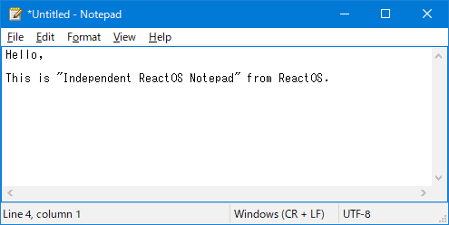

#  Independent ReactOS Notepad

This is `"Independent ReactOS Notepad"` from ReactOS.



It's a free and open source software for Windows XP and later.

<p align=center>
  <a href="https://reactos.org/donate/">
    
  </a>
  <a href="https://twitter.com/reactos">
    
  </a>
</p>

## Main code contributors

- Copyright ReactOS Development Team
- Copyright 1997,98,99 Marcel Baur <mbaur@g26.ethz.ch>
- Copyright 2000 Mike McCormack <Mike_McCormack@looksmart.com.au>
- Copyright 2002 Andriy Palamarchuk
- Copyright 2002 Sylvain Petreolle <spetreolle@yahoo.fr>
- Copyright 2019-2023 Katayama Hirofumi MZ <katayama.hirofumi.mz@gmail.com>
- and more!

## Translators

- Copyright 2011 Petru Dimitriu <petrimetri@gmail.com>
- Copyright 2011-2019 Ștefan Fulea <stefan.fulea@mail.com>
- Copyright 2012 Arda Tanrıkulu (ardatan) (ardatanrikulu [at] gmail [dot] com)
- Copyright 2013-2016, 2018-2019 Erdem Ersoy (eersoy93) (erdemersoy [at] erdemersoy [dot] net)
- Copyright 2015 Alvin Wong <alvinhochun@gmail.com>
- Copyright 2016 Henry Tang Ih (henrytang2@hotmail.com)
- Copyright 2018 Arnav Bhatt (arnavbhatt2004@gmail.com)
- Copyright 2018, 2022 Luke Luo <njlyf2011@hotmail.com>
- Copyright 2021 Chan Chilung <eason066@gmail.com>
- Copyright 2021-2022 Wu Haotian <rigoligo03@gmail.com>
- Copyright 2022 Andrej Bartulin <andrej.bartulinvr@gmail.com>
- Copyright 2023 Andrei Miloiu <miloiuandrei@gmail.com>
- Copyright Ardit Dani (Ard1t) (ardit.dani@gmail.com)
- Copyright Catalin Gabriel Draghita (jeffbox12)
- Copyright Ismael Ferreras Morezuelas (Swyter)
- Copyright Joann Mõndresku (joannmondresku at gmail dot com)
- Copyright Mário Kačmár /Mario Kacmar/ aka Kario (kario@szm.sk)
- and more!

## How to build?

Please use ReactOS Build Environment (RosBE).

```bash
git clone https://github.com/katahiromz/RNotepad
cd RNotepad
cmake -G Ninja -DCMAKE_BUILD_TYPE=Release .
ninja
strip notepad.exe
```

Tested on RosBE, Visual Studio 2015, and Visual Studio 2019.

## License

- LGPL 2.1 and later
